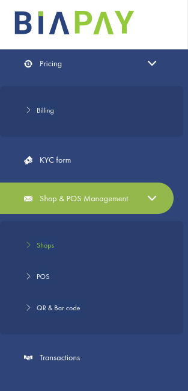

# Gestion des boutiques & des PDV(Point De Vente)
<figure markdown>
  { width="350" }
  <figcaption>menu gestion des Boutiques et des PDV</figcaption>
</figure>

## Boutiques

Une boutique est un magasin en ligne ou physique qui peut être constitué de plusieurs points de vente. La boutique par défaut est parente du point vente par défaut. L’utilisateur peut ajouter, modifier et désactiver une boutique. 

<!-- Elle est placée sous la responsabilité d’un gestionnaire. Le gestionnaire de la boutique créée par défaut à l’ouverture du compte est le titulaire du compte. Les gestionnaires des boutiques peuvent être modifiés. Les rôles et attributions des gestionnaires des boutiques font l’objet du chapitre Gestionnaires de boutique. -->

!!! Info 
     
    À l’activation du compte, une boutique et un point de vente sont créés par défaut. Ils portent par défaut le nom du marchand, ce nom peut être changé. 

### Gestion de vos boutiques

=== "Ajouter une boutique"
     
    Pour ajouter une boutique, procédez comme suit :

    * Ouvrir le sous-menu « Boutiques ».
    * Cliquer sur le bouton « Ajouter une boutique »
    * Indiquer le nom de la boutique et cliquer sur le bouton « Enregistrer »

=== "Modifier le nom d’une boutique"
     
    Pour modifier le nom d’une boutique, procéder comme suit :

    *  Ouvrir le sous-menu « Boutiques ».
    *  Sélectionner la boutique concernée.
    *  Cliquer sur le bouton « Modifier »
    *  Remplir les champs correspondants dans la fenêtre d’édition qui s’ouvre alors.
    *  Cliquer sur le bouton « Enregistrer »

=== "Désactiver une boutique"
     
    La boutique ne peut pas être supprimée. Par contre, elle peut être désactivée. 
    Pour désactiver une boutique, procéder comme suit :

    * Ouvrir le sous-menu « Boutique ».
    * Sélectionner la boutique concernée.
    * Cliquer sur le bouton « Désactiver »

<!-- === "Télécharger la liste des boutiques"

    Pour télécharger la liste des boutiques, procéder comme suit : 
        a. Se connecter à son compte professionnel.
        b. Ouvrir le menu « Boutiques ».
        c. Ouvrir le sous-menu « Boutiques », cliquer sur le bouton  pour télécharger la liste au format MS Excel et  au format PDF.

=== "Imprimer la liste des boutiques"

    Pour imprimer la liste des boutiques, procéder comme suit : 
        a. Se connecter à son compte professionnel.
        b. Ouvrir le menu « Boutiques ».
        c. Ouvrir le sous-menu « Boutiques ».
        d. Cliquer sur le bouton  pour imprimer la liste des boutiques sur une imprimante éventuellement raccordée à votre appareil. Vous pouvez également opter pour l’enregistrement au format PDF dans la boite de dialogue qui s’ouvre.
 -->

## Points de vente (PDV)

Un point de vente ou pdv est un terminal sur lequel les transactions sont réalisées dans une boutique. Le point de vente par défaut est enfant de la boutique par défaut. 

<!-- L’utilisateur peut ajouter, modifier, désactiver un point de vente. Le point de vente est placé sous la responsabilité d’un gestionnaire. 
Le gestionnaire du point de vente créé par défaut à l’ouverture du compte est le titulaire du compte. Les gestionnaires des points de vente peuvent être modifiés. Les rôles et attributions des gestionnaires des points de vente font l’objet du chapitre Gestionnaire du point de vente. -->

### Gestion de vos PDV

Etant connecté à votre compte marchand; vous avez la possibilté d' ajouter, modifier, désactiver un point de vente. Pour le faire, cliquez sur le menu « Boutiques » puis cliquez sur le sous-menu « Points de vente ».

=== "Ajouter un nouveau pdv"
     
    Pour ajouter un point de vente, procéder comme suit :
    
    * Cliquer sur le bouton « Ajouter un point de vente ».
    * Indiquer le nom du point de vente.
    * Choisir la boutique correspondante.
    * Indiquer l’URL de rappel.

    !!! information
         
        Une URL de rappel est le lien vers lequel la passerelle de paiement redirige après une transaction réussie ou échouée. Cette URL met à jour le statut de la transaction et affiche le message de réussite ou d’échec de la commande sur le site de commerce électronique par la suite.

=== "Modifier votre pdv" 
     
    Pour modifier un point de vente, procéder comme suit :

    * Sélectionner le point de vente concerné.
    * Cliquer sur le bouton « Modifier » .
    * Remplir les champs correspondants dans la fenêtre d’édition qui s’ouvre alors.  
    * Cliquer sur le bouton « Enregistrer ».

=== "Désactiver un pdv" 
     
    Un point de vente ne peut pas être supprimé. Par contre, il peut être désactivé.  
    Pour désactiver un point de vente, procéder comme suit :

    * Sélectionner le point de vente concerné.
    * Cliquer sur le bouton « Désactiver PDV » .

<!-- ## Télécharger la liste des points de vente 

Pour télécharger la liste des points de vente, procéder comme suit : 
    a. Se connecter à son compte professionnel.
    b. Ouvrir le menu « Boutiques ».
    c. Ouvrir le sous-menu « Points de vente ».
    d. Cliquer sur le bouton  pour télécharger la liste au format MS Excel et  au format PDF.

## Imprimer la liste des points de vente

Pour imprimer la liste des points de vente, procéder comme suit : 
    a. Se connecter à son compte professionnel.
    b. Ouvrir le menu « Boutiques ».
    c. Ouvrir le sous-menu « Points de vente ».
    d. Cliquer sur le bouton  pour imprimer la liste des points de vente sur une imprimante éventuellement raccordée à votre appareil. Vous pouvez également opter pour l’enregistrement au format PDF dans la boite de dialogue qui s’ouvre. -->