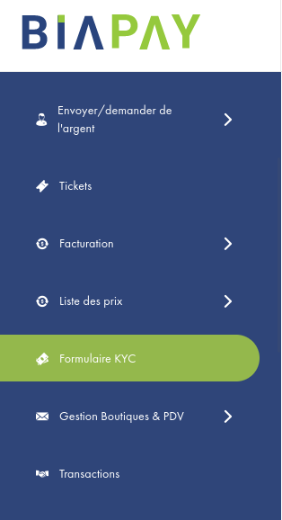

# KYC

## Identification des comptes marchands

<!-- Les étapes suivantes, vous indiquent comment passer l'étape d'identification. -->

1 - Se connecter au tableau de bord BIAPAY avec son  <strong>compte marchand</strong>

2 - cliquer sur l'onglet <strong>KYC form</strong> dans le menu principal du dashboard.

<figure markdown>
  { width="250" }
  <!-- <figcaption>Type de compte BIAPAY</figcaption> -->
</figure>

3 - Renseigner le formulaire d'identification, en fournissant les données des sections : <strong>details du profil</strong> et <strong>Information sur l'entreprise</strong>.

=== "Détail du profil"
    
    | Champ                                 | Description                                                | Type    | Requis  |
    | :--------------------------------     |     :----------------------------------------------------------|:------: |:-------:|
    | Type                                  |  Votre type     d'activité                                     |    A    |   Oui   |
    | Secteur industriel                    |  Votre secteur    d'activité                                  |    A    |   Oui   |
    | Nom                                   |  Votre    nom                                                 |    AN   |   Oui   |
    | Date de naissance                     |  Votre date de    naissoace                                   |    AN   |   Oui   |
    | Etat/Région                           |  Votre état ou    région                                      |    A    |   Non   |  
    | Code postal                           |  Le code postal de votre    structure                         |    N    |   Oui   |
    | Adresses                              |  Il faut définir vos    adresses                              |    AN   |   Oui   |     
    | Longitude                             |  Les coordonnées de géolocalisation de votre    structure     |    N    |   Non   |       
    | Latitude                              |  Les coordonnées de géolocalisation de votre    structure     |    N    |   Non   |       

=== "Information sur l'entreprise"

    | Champ                                 | Description                                                               | Type    | Requis  |
    | :-------------------------------------| :------------------------------------------------------------------------ |:------: |:-------:|
    | Nom de l'organisation                 |  Désignation de votre entreprise                                          |    A    |    Oui  |
    | Date d'enregistrement                 |  La date de création de votre structure                                   |    Date |    Non  |
    | Lien du site web                      |  Votre nom de domaine                                                     |    A    |     Non |
    | N° du registre de commerce            |  Votre numéro de registre de commerce                                     |    AN   |    Oui  |
    | N° de contribuable                    |  Votre numéro de contribuable                                             |    AN   |    Oui  |
    | Justificatifs                         |  Certains justificatifs doivent être téléversés notamment une preuve d'adresse                                                                                                           |    N    |    Oui  |

4 - Soumettre votre formulaire en cliquant sur <strong>Enregistrer & Envoyer</strong> 

!!! info 
     
    En attente de vérification, l’utilisateur professionnel aura accès en mode lecture. Il ne pourra inscrire ou sauvegarder aucune information sur les autres fonctionnalités de BIAPAY. 

    Le formulaire KYC sera en règle générale vérifié dans un délai maximum de 48 heures.

Une fois le formulaire KYC vérifié et validé, son statut change et il est désormais possible d’utiliser le système sans restriction.
