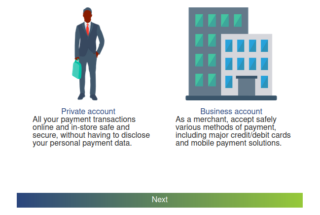
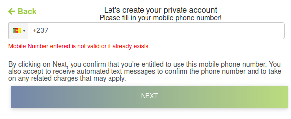
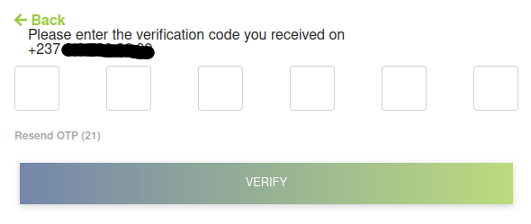

# Gestion des comptes utilisateurs

<!-- Afin de collecter, de faire vos paiements ou d'autres operations sur notre plateforme de paiement, il vous faut un compte utilisateur BIAPAY. 

!!! info BIAPAY

    Nous proposons à nos utilisateurs deux types de comptes, à savoir:

    - [Les comptes marchnd](#compte-marchand)
    - [Les comptes privés](#compte-prive) -->

### Etape de vérification du numéro de téléphone

Pour créer votre compte BIAPAY, allez à l'adresse suivante : [https://biapay.net/register](ttps://biapay.net/register).

1 - Sélectionner <strong>un type de compte</strong>, puis cliquer sur <strong>suivant</strong> comme indiqué sur l'image ci-dessous. 

<figure markdown>
  { width="350" }
  <!-- <figcaption>Type de compte BIAPAY</figcaption> -->
</figure>

<!-- 2 - Selectionner l'indicatif de votre pays dans la liste deroulante, puis entrer votre numéro de téléphone afin que vous envoyions un code otp . Ensuite cliquer sur le boutton `suivant`. -->

2 - Sélectionner l'indicatif de votre pays dans la liste déroulante, puis entrer votre numéro de téléphone. Ensuite cliquer sur <strong>suivant</strong>.

<figure markdown>
  { width="350" }
  <!-- <figcaption>code otp</figcaption> -->
</figure>

3 - Saisir le code reçu dans le champ prévu à cet effet, puis cliquer sur <strong>vérifier</strong> .

<figure markdown>
  { width="350" }
  <!-- <figcaption>Vérification du numéro de téléphone</figcaption> -->
</figure>

Vous venez de passer l'étape de vérification de votre numéro de téléphone. L'étape suivante de création de votre compte consiste à saisir vos données personnelles.

### Etape de création du compte

!!! info BIAPAY
     

    Nous proposons à nos utilisateurs deux types de comptes, à savoir:

    - [Les comptes marchnd](#)
    - [Les comptes privés](#)

=== "Creation d'un compte marchand"
     
    Pour créer votre compte marchand, procéder comme suit.  
    1 - Il faut remplir le formulaire de création de compte ; les données suivantes sont requises :

    | Champ                             | Description                                  | Type    | Requis  |
    | :-------------------------------- | :-----------------------------------------   |:------: |:-------:|
    | Nom commercial du marchand        |  Le nom de votre entreprise                  |    AN   |      O   |
    | Nom                               |  Le nom du propriétaire du compte            |    A    |      O   |
    | Prénom(s)                         |  Le(s) prénom(s) du propriétaire du compte   |    A    |      O   |
    | Code de parainage                 |  Votre code d'affialition                    |    AN   |      O   |
    | Adresse mail                      |  Votre adresse mail                          |    AN   |      O   |
    | Numéro de téléphone               |  Le numéro de téléphone indiqué à l’étape précédente est  renseigné automatiquement dans la case numéro de   téléphone.                                                                         |    N    |      O   |
    | Authentification à double facteur |  Activer l'authentification à double facteur |         |      N   |
    | Mot de passe                      | Le mot de passe doit contenir au minimum huit (08)  caractères, dont au moins un chiffre, une lettre majuscule, une lettre minuscule et un caractère   spécial.                                                                           |    AN   |      O   |
    | Confirmation du mot de passe      |  La confirmation du mot de passe             |         |      O   |
    | Question secrète                  |  La réponse à la question sécrète            |    A    |      N   |
    | Activation du captcha             |  Activer le captcha                          |         |      N   |
    | Les condoiton générales           |  Accepter les conditions générales           |         |      O   |

    2 - Après avoir renseigné les champs du formulaire d'inscription et accepté nos termes et conditions, cliquez sur <strong>s'inscrire</strong>.
    

=== "Creation d'un compte privé"
     
    Pour créer votre compte marchand, procéder comme suit.  
    1 - Il faut remplir le formulaire de création de compte ; les données suivantes sont requises :

    | Champ                             | Description                                  | Type    | Requis  |
    | :-------------------------------- | :-----------------------------------------   |:------: |:-------:|
    | Nom                               |  Le nom du propriétaire du compte            |    A    |     O   |
    | Prénom(s)                         |  Le(s) prénoms du propriétaire du compte     |    A    |     O   |
    | Adresse mail                      |  Votre adresse mail                          |    AN   |     O   |
    | Numéro de téléphone               |  Le numéro de téléphone indiqué à l’étape précédente est renseigné automatiquement dans la case numéro de téléphone.                                                                         |    N    |     O   |
    | Authentification à double facteur |  Activer l'authentification à double facteurs|         |     N   |
    | Mot de passe                      | Le mot de passe doit contenir au minimum huit (08) caractères, dont au moins un chiffre, une lettre majuscule, une lettre minuscule et un caractère spécial.                                                                           |    AN   |     O   |
    | Confirmation du mot de passe      |  La confirmation du mot de passe             |         |     O   |
    | Question secrète                  |  La réponse à la question sécrète            |    A    |     N   |
    | Activation du captcha             |  Activer le captcha                          |         |     N   |

    2 - Après avoir renseigné les champs du formulaire d'inscription et accepté nos termes et conditions, cliquez sur <strong>s'inscrire</strong>.

### Confirmation du compte

La confirmation de l'adresse mail est la dernière étape de création du compte. Nous vous enverrons un mail de confirmation à l'adresse mail indiquée lors de la création du compte.

!!! warning 

     
    Tout compte non activé se verra refuser l'accès au back-office BIAPAY.

<!--## Videos
 ## Contenus récomandés -->

