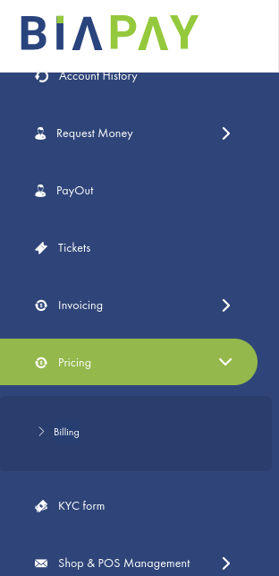

# Nos forfaits

<figure markdown>
  { width="350" }
  <figcaption>menu forfaits </figcaption>
</figure>

Dans le menu <strong>forfaits</strong>, l’utilisateur a la possibilité de souscrire à un abonnement et de changer de forfait. Comme indiqué sur l'image ci-dessous

## Gestion des forfaits

=== "Souscrire à un abonnement"
     
    Pour souscrire à un abonnement, procéder comme suit:

      * Dans le menu Forfaits, cliquez sur  <strong>forfaits</strong>
      * Puis sur <strong>Payer</strong>; indiquer la boutique et le point de vente concernés.
      * Cliquer sur <strong>Payer</strong> pour finaliser votre opération. 

    Le forfait souscrit est affiché sur l’écran.

=== "Modifier son abonnement"
     
    Il est possible à tout moment de migrer vers un surclassement en cours d’abonnement. 
    Pour effectuer un surclassement, procéder comme suit :

      * Ouvrir le menu « Forfaits ».
      * Sélectionner un forfait de la classe supérieure.
      * Souscrire au forfait sélectionné (Voir Souscrire à un abonnement).

    Felicitation, vous venez de mettre jour votre forfait. L’ancienne souscription est remplacée par la nouvelle souscription.

## Se désabonner

Lorsque l’abonnement d’une formule payante arrive à expiration, sur résiliation explicite du marchand ou de BIAPAY, sans que le compte ne soit définitivement fermé, le forfait par défaut sera de nouveau assigné au point de vente.

!!! warning 

    - Il est impossible de migrer vers un déclassement en cours d’abonnement.

    - Le forfait par défaut est assigné à tous les comptes professionnels nouvellement créés ainsi qu’à tous les points de vente nouvellement créés. 

